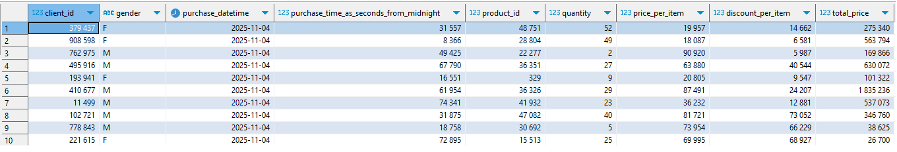

# Извлечение данных → загрузка данных в СУБД PostgreSQL → визуализация в Metabase
Создана система для работы с данными маркетплейса:
-данные автоматически загружаются через API каждый день;
-сохраняются в базе данных PostgreSQL;
-дашборд в Metabase.

## Основные этапы
- Получить данные через API покупо на маркетплейсе.
- Развернуть PostgreSQL, создать таблицу и загрузить в нее данные .
- Выполнить историческую загрузку всего требуемого диапазона.
- Загружать новые данные ежедневно в 07:00 за вчерашний день.
- Развернуть Metabase и собрать дашборд по продажам, ассортименту и клиентам.
- Провести 2 исследования на данных 2023 года:
-- Исследование ассортиментной матрицы
-- Исследование клиентской базы.

## Описание данных

Таблица `sale_market` содержит транзакционные данные маркетплейса:
| Поле | Описание |
|------|-----------|
| `client_id` | ID клиента |
| `gender` | пол клиента |
| `purchase_datetime` | Дата и время покупки |
| `purchase_time_as_seconds_from_midnight` | Количество секунд, прошедших с начала суток |
| `product_id` | ID товара | 
| `quantity` | Количество |
| `price_per_item` | Цена за единицу |
| `discount_per_item` | Скидка |
| `total_price` | Итоговая сумма покупки |

Эти данные формируют данные, необходимые для осуществления анализа в сфере продаж и исследования характеристик клиентской базы

## Подготовка базы данных PostgreSQL
До запуском ETL пайплайна необходимо создать базу данных и таблицы в PostgreSQL:

1. Создайте базу данных
```sql
CREATE DATABASE sale_market;
```

## Установка и запуск
1. Клонируйте репозиторий

```bash
git clone https://github.com/Danil026/Final_Sim.git
cd Final_Sim
```
2. Создайте и активируйте виртуальное окружение
<details> 
<summary>macOS / Linux</summary>

```bash
python3 -m venv venv
source venv/bin/activate
```
</details> 
<details> 
<summary>Windows</summary>

```cmd
python -m venv venv
venv\Scripts\activate
```
</details>

3. Установите зависимости

```bash
pip install -r requirements.txt
```
4. Настройте `config.ini
Образец есть в корневой директории проекта`
Содержание файла:
[database]
databname = "имя базы данных"
user = "Имя пользователя"
password = "Пароль"
host = "Хост"
port = Порт
[data_settings]
all_load = 1
date_start =2023-01-01

all_load - это триггер который определяет режим работы скрипта:
1 - Историческая загрузка данных начиная с date_start
0 - за предыдущий день, игнорирет date_start.

5. Загрузите исторические данные
предварительно нужно поставить значение в файле config.ini
all_load = 1
date_start =2023-01-01

```bash
python API_extract.py

```
6. Ежедневная загрузка новых данных в базу
предварительно нужно поставить значение в файле config.ini
all_load = 0
```bash
python API_extract.py
```
## Автоматизация
### Windows:

Используйте планировщик заданий, указав запуск `API_extract.py` в нужные дни.

### Linux/macOS (через `cron`):

1. Откройте редактор crontab:

```bash
crontab -e
```
2. Добавьте строку для ежедневного запуска:

```bash
0 7 * * * /path/to/venv/bin/python /path/to/API_extract.py 
```
## Визуализация в Metabase
[Дашборд →](http://91.201.40.224:3000/dashboard/2-dashbord-prodazh-c-2023-g?%25D0%25B2%25D1%258B%25D0%25B1%25D0%25B5%25D1%2580%25D0%25B8%25D1%2582%25D0%25B5_%25D0%25B4%25D0%25B0%25D1%2582%25D1%2583=&%25D0%25B2%25D1%258B%25D0%25B1%25D0%25B5%25D1%2580%25D0%25B8%25D1%2582%25D0%25B5_id__%25D0%25BF%25D1%2580%25D0%25BE%25D0%25B4%25D1%2583%25D0%25BA%25D1%2582%25D0%25B0=&tab=4-общий)


Расчеты всех метрик находятся в Metabase/SQL_Metabase.sql
Основные показатели:
- Выручка, количество продаж по дням  
- Скидки и средний чек
- Активность клиентов, частота покупок
- Retention

## Результаты анализа
- Проведён ABC_XYZ-анализ ассортимента, определены категории с низкой рентабельностью.  
- Выполнен когортный и RFM анализ клиентов и рассчитан LTV.  
- Определены пиковые месяцы по выручке и покупательной активности клиентов.  
- Построен дашборд для мониторинга ключевых показателей.

## Стек технологий
- Python 3.11+: requests / pandas / psycopg2
- PostgreSQL 14+
- Metabase
- Scheduling: cron
